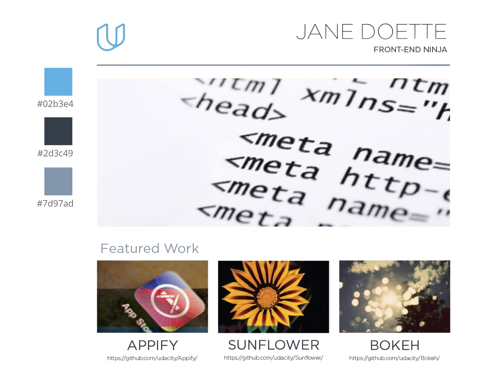
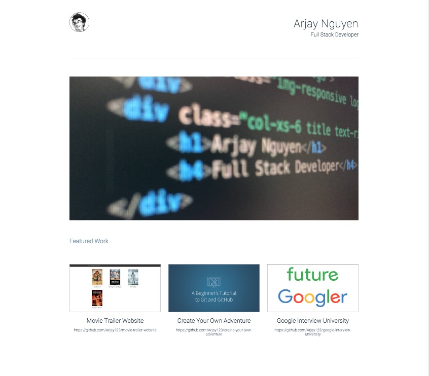

## responsive-portfolio

A responsive webpage to display portfolio projects completed in Udacity's Full stack developer nanodegree program


Project 2 for Udacity's Full Stack Engineer class. The task was to replace a provided design mockup using HTML and CSS and design a responsive website


## Install

Simply clone or download the zip file


## Libraries used

Bootstrap - HTML, CSS, and JS Framework<br>
jquery-gh-readme - Used to convert readme markdown from github repos into HTML

All of the above libaries are included in the repo

## Usage

You will need to run this on a local server in order for the readme script to run, as well as the responsive images to work properly. I recommend SimpleHTTPServer which is included in the python standard library

Run this command from the terminal with the project folder as the current working directory
```
python -m SimpleHTTPServer
```

You can then access the website by navigating to 127.0.0.1:8000


Provided design mockup


Screenshot of completed webpage

